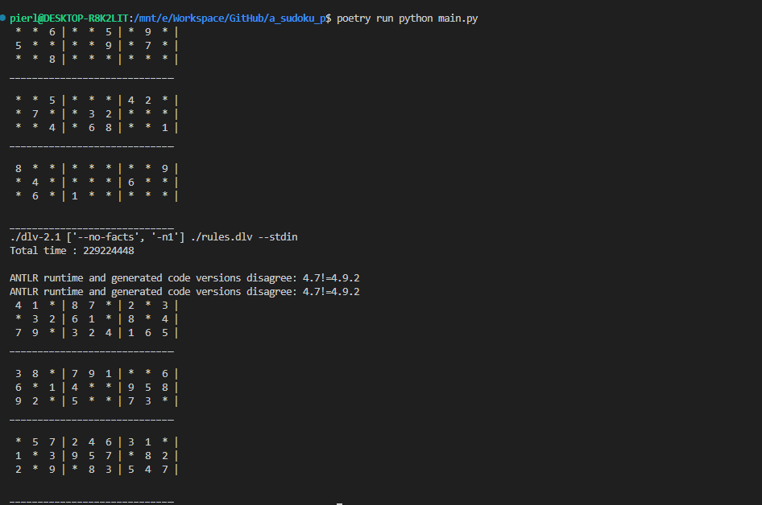

### AS(udoku)P - Answer Set Programming for sudoku game
This is a python TUI script that use (DLV solver)[https://dlv.demacs.unical.it/home] for sudoku resolution.

### Install
- clone the repo
- the project use (`poetry`)[https://python-poetry.org/] as package manager
-   install third-party modules with `poetry install`

### Usage
- The `main.py` script takes grid from `input.txt`. Update it
- type `poetry run python main.py`

### Screenshot

